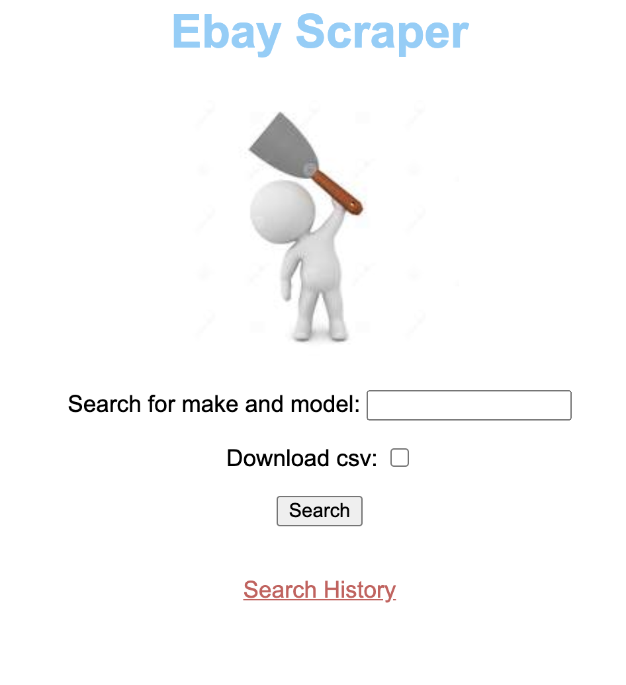
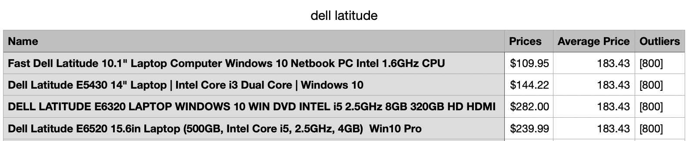

# Ebay Scraper

This program is designed to scrape active Ebay listings and create a .csv file containing data from the search. The .csv has four columns which are as follows: product name, price, average price of listings, and outliers.





## Usage

Clone this repo and start up your shell
```
pipenv shell
```

Run the server
```
python3 manage.py runserver
```

### Meta
[https://github.com/dougenas/ebay_scraper](https://github.com/dougenas/)
